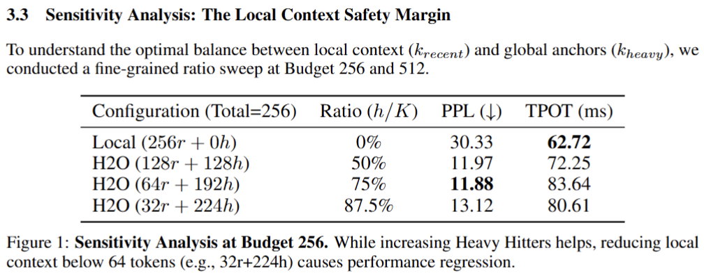

# H2O: Heavy Hitter Oracle Reproduction on Pythia-2.8B

This repository contains the reproduction code for the **H2O (Heavy Hitter Oracle)** KV cache compression algorithm, evaluated on the **Pythia-2.8B** model. This project demonstrates how identifying "Heavy Hitters" (important tokens) and "Attention Sinks" allows for massive memory reduction (up to ~90%) while maintaining generation quality.

## Project Structure

The project is organized as follows:

```text
.
├── main.py                # Entry point: Runs the full benchmark suite
├── plot_heatmap.py        # Visualization: Generates attention heatmaps with Log-Scale
├── requirements.txt       # Python dependencies
├── report.pdf             # The final report
├── model/                 # default model and dataset path
├── src/                   # Core implementation package
│   ├── __init__.py
│   ├── config.py          # Model and experiment configurations
│   ├── model_patch.py     # Monkey-patching logic for H2O implementation
│   ├── h2o_state.py       # Global state management for KV cache eviction
│   ├── benchmark.py       # Evaluation loops (PPL, TPOT, Memory)
│   └── data_loader.py     # Data loading utilities (Wikitext-2)
└── README.md              # Project documentation

```
## Installation
### Prerequisites
``` text
Python 3.8+
GPU with CUDA support (Recommended: 8GB+ VRAM for Pythia-2.8B FP16)
Install Dependencies Run the following command to install all required packages:
```

``` Bash
pip install -r requirements.txt
```
### Usage
1. Run Benchmarks
To reproduce the experimental results (Perplexity, Throughput, Memory Usage) presented in the report:
``` Bash
python main.py
```
``` text
What it does:

Loads EleutherAI/pythia-2.8b (FP16).
Downloads the wikitext-2 test set.(Directly use if already exists)
Runs a suite of experiments: Full Cache (Baseline), Local Attention, and H2O with various budgets.
Outputs a summary table to the console and saves results to CSV.
```
1. Generate Visualizations
To verify the "Attention Sink" and "Heavy Hitter" hypotheses by generating attention heatmaps:

``` Bash
python plot_heatmap.py
```
``` text
What it does:

Runs inference on a short, punctuation-heavy text.
Captures attention matrices from shallow (Layer 2), middle (Layer 16), and deep (Layer 30) layers.
Applies Logarithmic Normalization to highlight sparse features.
Saves images as heatmap_layer_xx_log.png.
```
## Configuration
```
You can modify experiment settings in src/config.py:

CACHE_DIR: Model and dataset load path (default: ./model)
MODEL_ID: Change the target model (default: EleutherAI/pythia-2.8b).
BENCHMARK_CONFIG: Adjust sequence lengths for PPL evaluation or speed tests.
```
If you want to test more(or less) experiment groups, please change it in **mian.py!**

## Results

I declared method and experiments details in a NeurIPS-Style paper, Here we can have a glance at main results:



`PS：这部分写了篇论文是因为最开始没有看清楚提交要求，误以为个人部分和小组部分都要写论文（苦笑），后来发现似乎只需要简述结论就好了，但论文已经写了一大半了，觉得不写完有一些可惜，于是还是完整把论文写出来了。毕竟还是花费了不少精力，劳请助教能大概看一眼QWQ（球球了）`